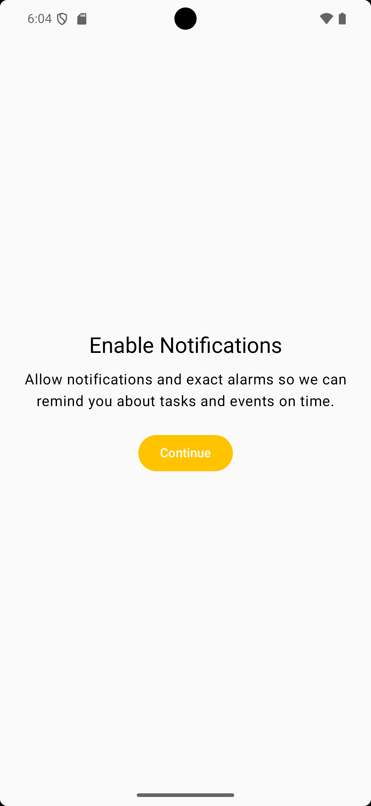
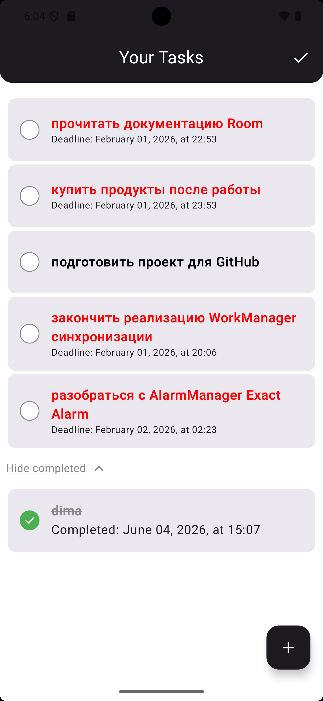
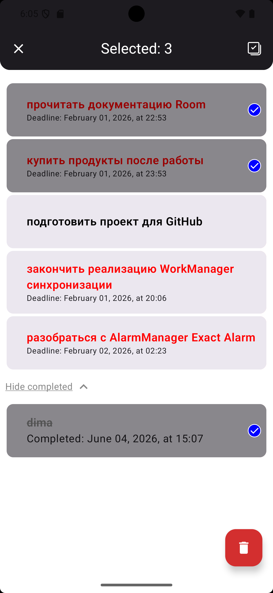
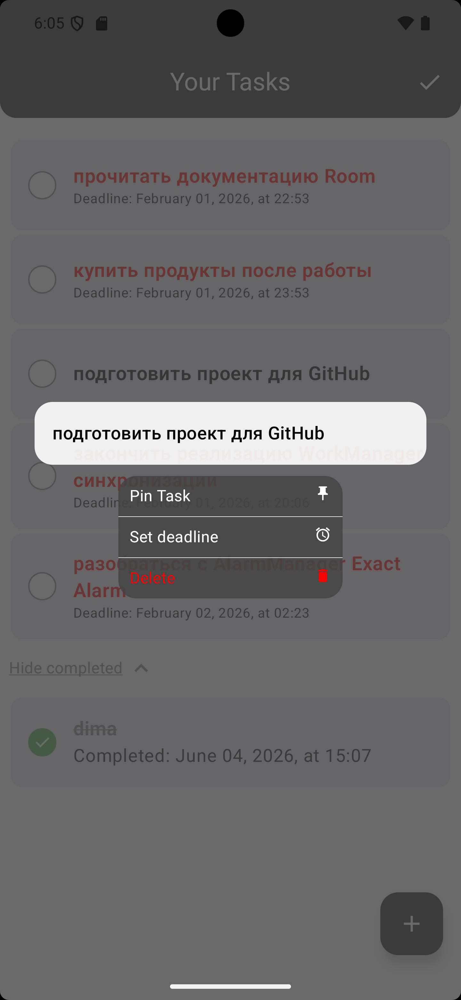
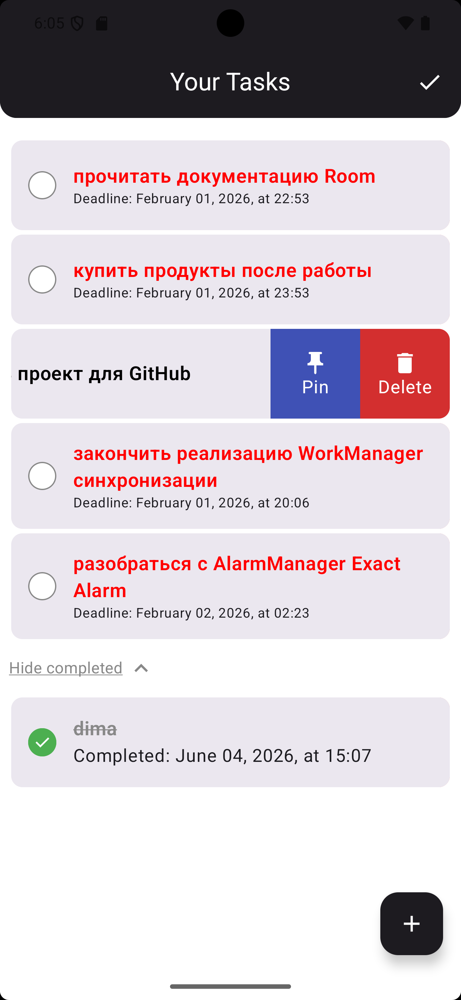
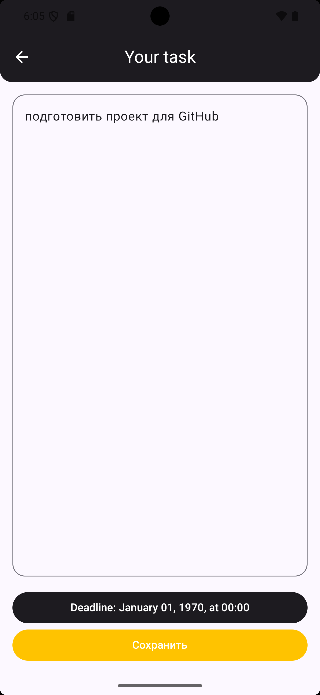
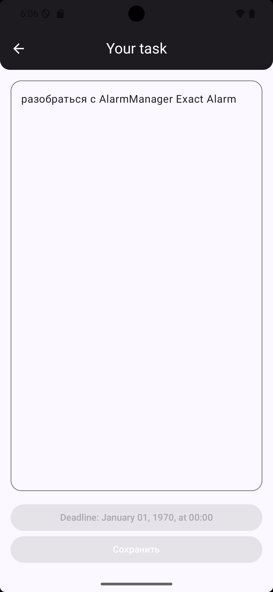
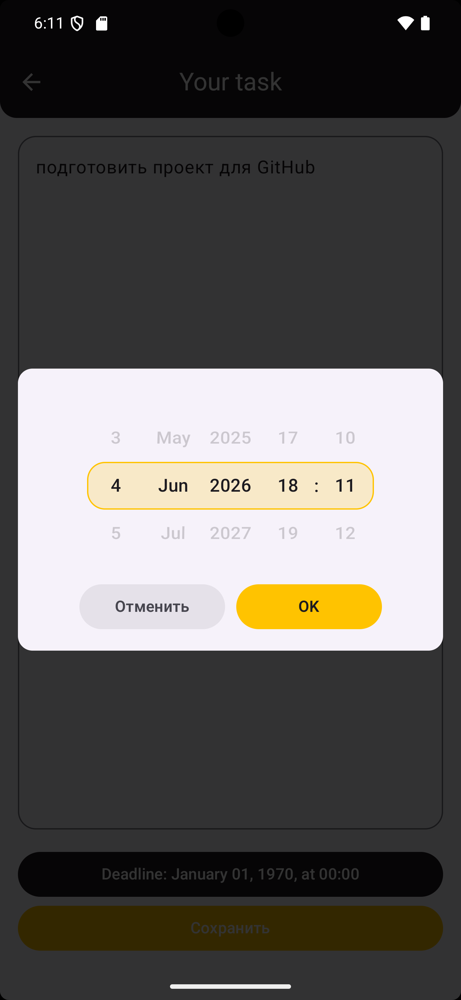

# Android-приложение для управления задачами

Приложение для управления задачами, разработанное на Kotlin с использованием Jetpack Compose.

---

## ✨ Возможности

- Создание, редактирование и удаление задач
- Отметка задач как выполненных
- Закрепление важных задач
- Добавление дедлайнов и напоминаний
- Swipe to reveal
- Pull to refresh
- Preview Dialog
- Оффлайн-режим работы
- Автоматическая синхронизация при появлении интернета
- Уведомления о дедлайнах

---

## 🛠 Технологии

Kotlin  
Jetpack Compose  
Clean Architecture  
MVVM  
Kotlin Coroutines  
Flow  
Room  
Retrofit  
Dagger 2  
WorkManager  
AlarmManager  
NotificationManager  
ViewModel  

---

## 🚀 Особенности

- Offline-first подход  
- Реактивный UI  
- Фоновая синхронизация данных  
- Точные уведомления (Exact Alarm)  

## 📸 Ui приложения

  
  
  

  
  
  

  
  

